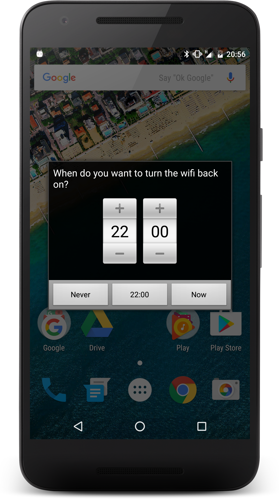
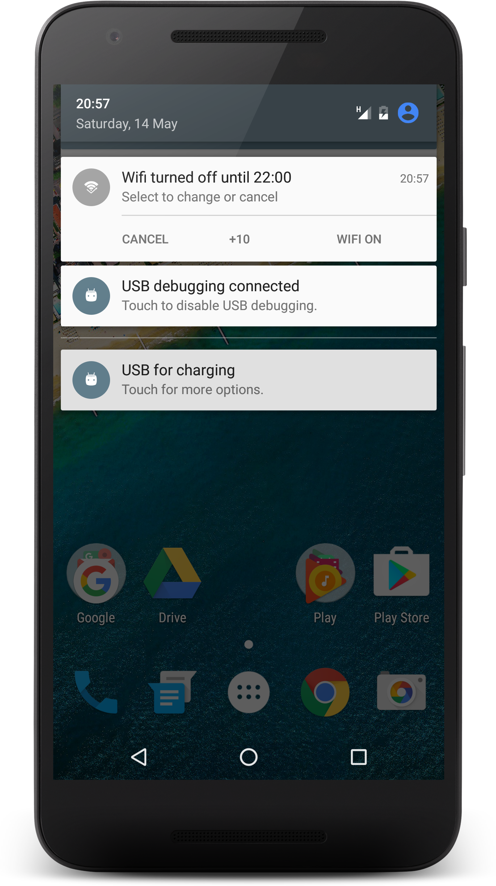

 Wifi Timer
==========================================

__Spare your battery life by deactivating wifi for a few hours using Wifi
Timer!__

When installed, each time you turn your wifi off, you will be asked how
long you would like before restoring it. After that amount of time has
passed, your wifi will be automatically turned back on.

### [Download now!](https://play.google.com/store/apps/details?id=org.laurentsebag.wifitimer)

-------------------------------------------------------------------------------

This is an free software application released under the Gnu GPL v3 or later.

This program is distributed in the hope that it will be useful, but WITHOUT
ANY WARRANTY; without even the implied warranty of MERCHANTABILITY or FITNESS
FOR A PARTICULAR PURPOSE. See the GNU General Public License for more details.
